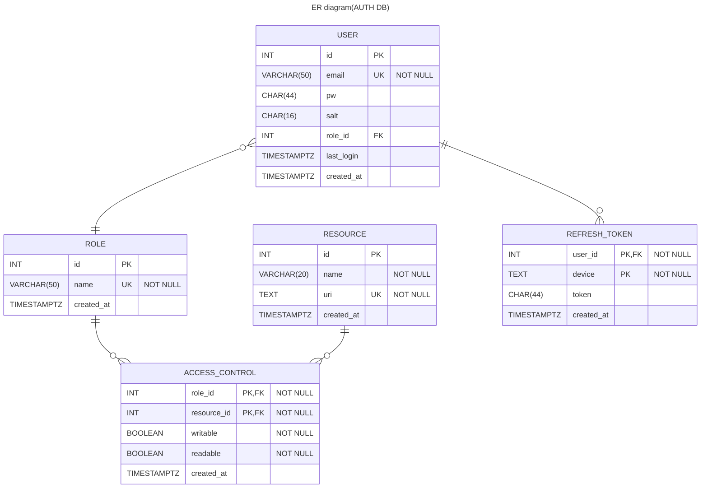
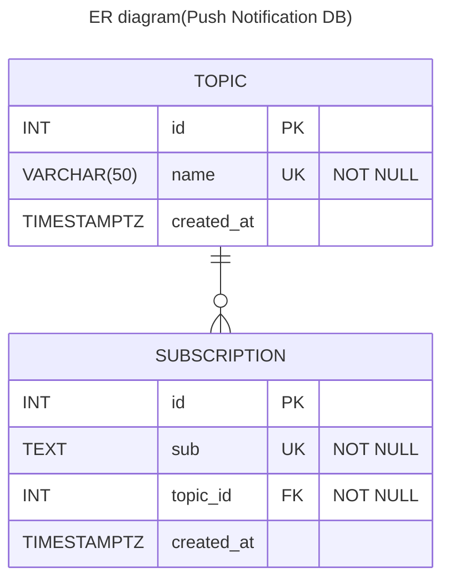

# Database

## ER diagrams

### AUTH DB

```mermaid
---
title: ER diagram(AUTH DB)
---
erDiagram

ROLE {
  INT id PK
  VARCHAR(50) name UK "NOT NULL"
  TIMESTAMPTZ created_at
}

RESOURCE {
  INT id PK
  VARCHAR(20) name "NOT NULL"
  TEXT uri UK "NOT NULL"
  TIMESTAMPTZ created_at
}

ACCESS_CONTROL {
  INT role_id PK, FK "NOT NULL"
  INT resource_id PK, FK "NOT NULL"
  BOOLEAN writable "NOT NULL"
  BOOLEAN readable "NOT NULL"
  TIMESTAMPTZ created_at
}

USER {
  INT id PK
  VARCHAR(50) email UK "NOT NULL"
  CHAR(44) pw
  CHAR(16) salt
  INT role_id FK
  TIMESTAMPTZ last_login
  TIMESTAMPTZ created_at
}

REFRESH_TOKEN {
  INT user_id PK, FK "NOT NULL"
  TEXT device PK "NOT NULL"
  CHAR(44) token
  TIMESTAMPTZ created_at
}

ROLE ||--o{ ACCESS_CONTROL : ""
RESOURCE ||--o{ ACCESS_CONTROL : ""

USER }o--|| ROLE : ""
USER ||--o{ REFRESH_TOKEN : ""
```

### Push Notification DB

```mermaid
---
title: ER diagram(Push Notification DB)
---
erDiagram

TOPIC {
  INT id PK
  VARCHAR(50) name UK "NOT NULL"
  TIMESTAMPTZ created_at
}

SUBSCRIPTION {
  INT id PK
  TEXT sub UK "NOT NULL"
  INT topic_id FK "NOT NULL"
  TIMESTAMPTZ created_at
}

TOPIC ||--o{ SUBSCRIPTION : ""
```
