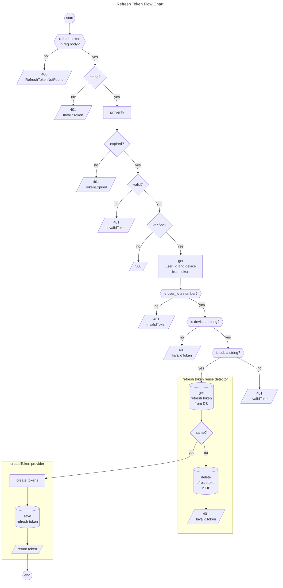

# Flow Chart for Refresh Token

```mermaid
---
title: Refresh Token Flow Chart
---
flowchart TB
S((start)) --> Q1{{refresh token<br>in req body?}}
Q1 -- no --> E1[/400<br>RefreshTokenNotFound/]
Q1 -- yes --> Q2{string?}
Q2 -- no --> E2[/401<br>InvalidToken/]
Q2 -- yes --> T1[jwt.verify]
T1 --> Q3{expired?}
Q3 -- no --> E3[/401<br>TokenExpired/]
Q3 -- yes --> Q4{valid?}
Q4 -- no --> E4[/401<br>InvalidToken/]
Q4 -- yes --> Q5{verified?}
Q5 -- no --> E5[/500/]
Q5 -- yes --> T2[get<br>user_id and device<br>from token]
T2 --> Q6{{is user_id a number?}}
Q6 -- no --> E6[/401<br>InvalidToken/]
Q6 -- yes --> Q7{{is device a string?}}
Q7 -- no --> E7[/401<br>InvalidToken/]
Q7 -- yes --> Q8{{is sub a string?}}
Q8 -- no --> E8[/401<br>InvalidToken/]
Q8 -- yes --> T3[(get<br>refresh token<br>from DB)]
  subgraph  SG1 [refresh token reuse detector]
  direction TB
  T3 --> Q9{same?}
  Q9 -- no --> T4[(delete<br>refresh token<br>in DB)]
  T4 --> E9[/401<br>InvalidToken/]
  end
Q9 -- yes --> T5["create tokens"]
  subgraph  SG2 [createToken provider]
  direction TB
  T5 --> T6[(save<br>refresh token)]
  T6 --> T7[/return token/]
  end
T7 --> E((end))
```
